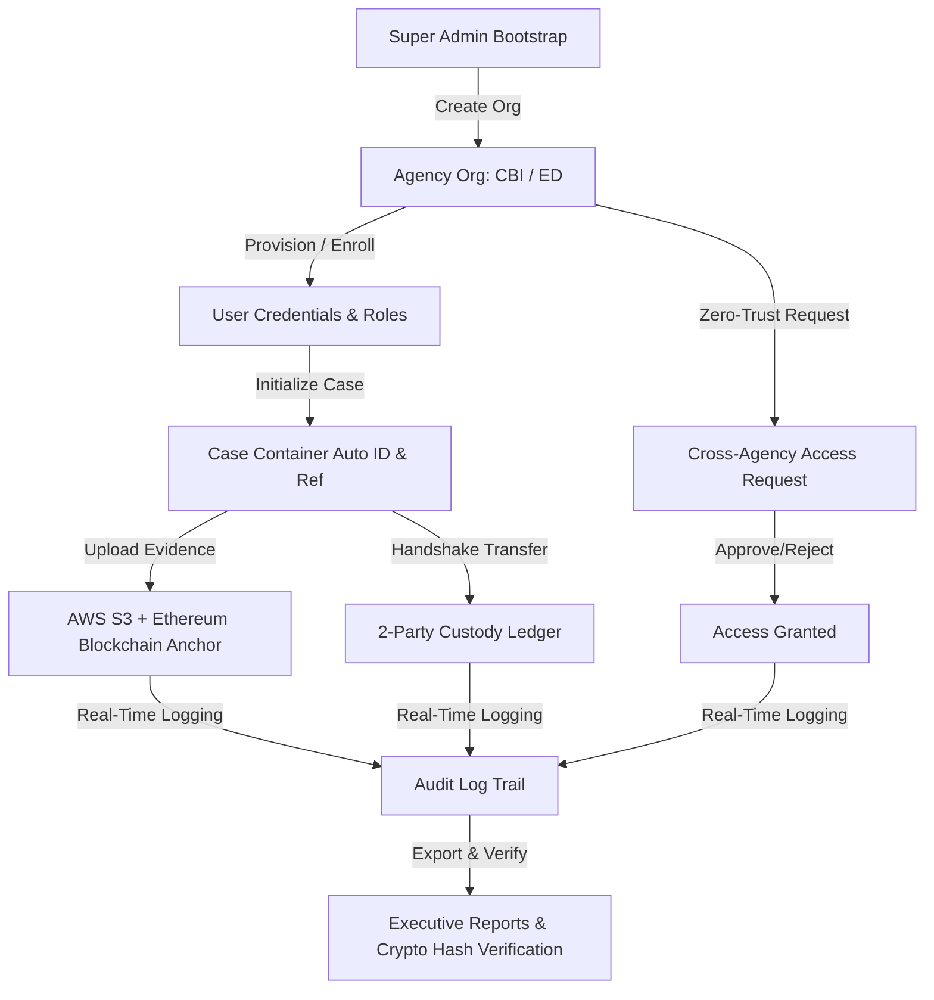
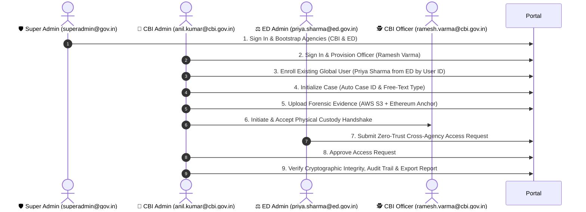

# 📖 Master Demonstration & End-to-End User Story Guide (`sih_ps1`)

This guide is the definitive manual testing and operational demonstration manual for the **Secure Digital Document & Evidence Management System (`sih_ps1`)**.

It provides operational rules on **when and why** to perform core actions (creating organizations, managing credentials, uploading documents, inspecting audit logs, generating reports, and testing access requests), followed by an exhaustive, step-by-step **7-Act Master User Story Walkthrough**.

---

## 🌐 Quick Access URLs & Standard Credentials

| Resource / Portal | Access URL | Credentials / Shortcuts |
| :--- | :--- | :--- |
| **Frontend Web Portal** | 👉 [http://localhost:5173/](http://localhost:5173/) | Use Quick Demo Shortcuts on the login page |
| **Backend REST API** | 👉 [http://localhost:5000/api](http://localhost:5000/api) | Health Check: [http://localhost:5000/health](http://localhost:5000/health) |
| **Interactive OpenAPI Docs** | 👉 [http://localhost:5000/api-docs](http://localhost:5000/api-docs) | Complete Swagger UI API reference |

---

## 🧭 Operational Governance & System Rules

Before executing test scenarios, understand the key operational workflows, design principles, and criteria for each system feature.

---

### 1. 🏢 When to Create Another Organization
- **Operational Criterion**: Create a new organization whenever a separate legal entity, government agency, law enforcement division, or external forensic lab requires its own isolated data domain, user hierarchy, and case workspace.
- **Examples**: 
  - `Central Bureau of Investigation (CBI)` – Federal investigative body handling cyber crime and corruption.
  - `Enforcement Directorate (ED)` – Financial intelligence agency handling money laundering.
  - `State Cyber Crime Cell (SCCC)` – Regional law enforcement handling localized cyber threats.
  - `Forensic Science Laboratory (FSL)` – Third-party laboratory providing independent digital forensic analysis.
- **Key Characteristics**:
  - Each organization operates under tenant isolation.
  - Organization Admins can manage users, roles, and cases strictly inside their agency domain.
  - Cross-organization access to cases is **strictly prohibited by default** and requires explicit Zero-Trust **Access Requests**.

---

### 2. 🔑 When to Add User Credentials & Manage Roles
- **Operational Criterion**: Add credentials or enroll users whenever an officer, analyst, or administrator requires system access.
- **Two User Onboarding Modes**:
  1. **Provision New User Account** *(When onboarding a brand new officer to your organization)*:
     - Used when an officer does not exist anywhere in the global system directory.
     - Automatically provisions full credentials (Email, Password) and assigns a dynamic dynamic role (e.g., `Investigating Officer`, `Forensic Analyst`, `Organization Admin`).
  2. **Enroll Existing Global User by User ID** *(When forming multi-agency joint task forces or assigning cross-org advisors)*:
     - Used when an officer already has an account registered in another organization or is an unassigned global specialist.
     - Uses the target user's **User ID** (`cm...`) to grant them membership and a role within the current organization without duplicating credentials or creating redundant accounts.
- **Dynamic Role Management**:
  - Roles are fetched dynamically from the database (`GET /api/v1/organizations/:organizationId/roles`), eliminating hardcoded role IDs (like `c1`).

---

### 3. 📄 When & How to Upload Documents & Evidence
- **Operational Criterion**: Upload documents whenever digital evidence (forensic disk dumps, packet captures, financial ledgers, wiretaps) or case documentation (search warrants, court orders, witness statements) is seized or generated.
- **Technical Execution**:
  - **Storage**: The raw binary file is streamed to **AWS S3** object storage.
  - **Cryptographic Fingerprinting**: A **SHA-256 checksum** is calculated client-side and server-side.
  - **Blockchain Anchoring**: The document metadata and SHA-256 fingerprint are anchored to an **Ethereum smart contract**, creating an immutable, timestamped proof of existence.
  - **Chain of Custody Tagging**: Uploading a document automatically registers an initial custody event tied to the uploader.

---

### 4. 🔍 How to Inspect & Verify Audit Logs
- **Operational Criterion**: Inspect audit logs during active investigations, court disclosure proceedings, or security compliance audits to ensure no evidence has been altered or accessed unlawfully.
- **Two Audit Viewports**:
  1. **System-Wide Audit Log** (`/audit`): Displays global activity across all organizations (for Super Admins) or agency-wide activity (for Org Admins). Tracks user logins, organization creation, cross-agency requests, role changes, and systemic security events.
  2. **Case-Specific Timeline & Audit Log**: Found inside the Case Details page under the **Audit Trail** tab. Shows every lifecycle event (`CASE_CREATED`, `DOCUMENT_UPLOADED`, `CUSTODY_TRANSFER_INITIATED`, `CUSTODY_TRANSFER_ACCEPTED`) linked with actor IDs, IP addresses, timestamps, and cryptographic hash links.
- **Cryptographic Verification**:
  - Navigate to **Verification** (`/verification`) to execute automated dual-hash comparisons between the stored binary in S3 and the cryptographic receipt on the Ethereum blockchain.

---

### 5. 📊 How to Generate & Verify Reports
- **Operational Criterion**: Generate reports for judicial presentation, executive briefings, or periodic regulatory compliance audits.
- **Available Report Types**:
  - **Chain of Custody Ledger Report**: Detailed chronological record of physical and digital custody transfers for a specific case or evidence item.
  - **Agency Compliance Summary**: Overview of total cases, document integrity checks, access requests granted/denied, and audit event volume.
  - **Case Forensic Summary**: Comprehensive case file listing all attached documents, blockchain hashes, and participating officers.
- **Verification of Reports**:
  - Generated reports include a digital verification stamp and QR code/hash referencing the tamper-evident audit trail log entry.

---

### 6. 🔐 How to Test Access Requests (Zero-Trust Model)
- **Operational Criterion**: Test access requests when an officer or agency needs to view or collaborate on a case owned by a different organization.
- **Step-by-Step Testing Flow**:
  1. **Request Submission**: An officer from Agency B (e.g., ED) searches for Case ID owned by Agency A (e.g., CBI) and submits an Access Request specifying legal justification.
  2. **Review & Approval**: The Case Owner or Org Admin in Agency A reviews the pending request under **Access Requests** (`/access-requests`) and chooses to **Approve** or **Reject**.
  3. **Verification**: Once approved, the request status updates to `APPROVED`, and Agency B's officer immediately gains read/audit access to the target case file.

---

## 🏛️ End-to-End Master Demonstration Sequence

---

## 🚀 Step-by-Step 7-Act Demonstration Script

### 🎬 Act 1: Platform Bootstrapping & Multi-Agency Registration

#### **User Story 1.1: Super Admin Sign In**
1. Open browser to **[http://localhost:5173/login](http://localhost:5173/login)**.
2. Under **⚡ Quick Demo Login Shortcuts**, click **`🛡️ Super Admin`**.
   - *Auto-filled values*: Org Code: `GOV-SUPERADMIN`, Email: `superadmin@gov.in`, Password: `Password123!`
3. Click **Sign In to Portal**.
   - *Expected Outcome*: Successful login; redirected to **System Overview Dashboard** displaying global agency count and metrics.

#### **User Story 1.2: Register Agency #1 — Central Bureau of Investigation (CBI)**
1. Navigate to **Organizations** in the sidebar (`/organizations`).
2. Click **Register Organization** (top right button).
3. Fill out the registration modal:
   - **Organization Name**: `Central Bureau of Investigation`
   - **Short Code**: `CBI-001`
   - **Compulsory Admin Option**: Ensure **Create New User** toggle is selected.
   - **Admin Officer Name**: `Sub-Inspector Anil Kumar`
   - **Official Admin Email**: `anil.kumar@cbi.gov.in`
   - **Temporary Password**: `Password123!`
4. Click **Bootstrap & Provision Agency**.
   - *Expected Outcome*: Toast notification confirms agency provisioned; `Central Bureau of Investigation (CBI-001)` appears on the grid.

#### **User Story 1.3: Register Agency #2 — Enforcement Directorate (ED)**
1. Click **Register Organization** again.
2. Fill out the registration modal:
   - **Organization Name**: `Enforcement Directorate`
   - **Short Code**: `ED-001`
   - **Compulsory Admin Option**: Select **Create New User**.
   - **Admin Officer Name**: `Director Priya Sharma`
   - **Official Admin Email**: `priya.sharma@ed.gov.in`
   - **Temporary Password**: `Password123!`
3. Click **Bootstrap & Provision Agency**.
   - *Expected Outcome*: `Enforcement Directorate (ED-001)` card appears alongside CBI.

---

### 🎬 Act 2: User Provisioning, Dynamic Roles & Cross-Org Enrollment

#### **User Story 2.1: Log in as CBI Lead Admin (Anil Kumar)**
1. Log out or return to **[http://localhost:5173/login](http://localhost:5173/login)**.
2. Click **`🏢 CBI Lead Officer`** shortcut (or enter Org Code: `CBI-001`, Email: `anil.kumar@cbi.gov.in`, Password: `Password123!`).
3. Click **Sign In to Portal**.
   - *Expected Outcome*: Logged in as `Sub-Inspector Anil Kumar` under `CBI-001` context.

#### **User Story 2.2: Provision a Brand New Officer Account**
1. Navigate to **Users** (`/users`).
2. Click **Add Officer / User**.
3. Select **Provision New User Account** tab:
   - **Officer Full Name**: `Inspector Ramesh Varma`
   - **Official Email**: `ramesh.varma@cbi.gov.in`
   - **Password**: `Password123!`
   - **Assign Dynamic Role**: Select `Investigating Officer` (dynamically loaded from backend roles API).
4. Click **Provision New Account**.
   - *Expected Outcome*: `Inspector Ramesh Varma` appears in the CBI roster table.

#### **User Story 2.3: Enroll Existing Global User by User ID**
1. Click **Add Officer / User** again.
2. Select **Enroll Existing Global User (By User ID)** tab.
3. Select from dropdown or paste User ID for **Director Priya Sharma** (`priya.sharma@ed.gov.in`).
4. Select **Assign Organization Role**: `Investigating Officer` / `Special Advisor`.
5. Click **Enroll Officer into Org**.
   - *Expected Outcome*: Green success toast (`✅ Existing global user enrolled into organization!`); Priya Sharma is granted dual membership in CBI.

---

### 🎬 Act 3: Case Initialization (Auto Case ID & Free-Text Type)

#### **User Story 3.1: Create Case File Container**
1. Navigate to **Cases** (`/cases`).
2. Click **Initialize New Case**.
3. Type **Case Title**: `Operation Financial Trace & Disk Tampering`
4. *Observe Live Auto-Generation*:
   - **Global Case ID**: Automatically generated as `CBI-OFT-YYYYMMDD-XXXX` (e.g., `CBI-OFT-20260905-4812`).
   - **Dept Reference No**: Automatically generated as `CBI/OFT/2026/XXXX` with an interactive **Regenerate** button.
5. Type **Case Type**: Free-text entry `Cyber Crime & Financial Fraud` *(No rigid predefined dropdown constraints!)*
6. *Observe Form Refinement*: Priority level selection dropdown has been completely removed to avoid subjective bias.
7. Fill **Case Description**: `Joint investigation into compromised banking servers and forensic disk dumps.`
8. Click **Initialize Case File**.
   - *Expected Outcome*: Case container is created, stored in PostgreSQL DB, and displayed in the Cases table.

---

### 🎬 Act 4: Digital Evidence Upload, S3 Storage & Ethereum Anchoring

#### **User Story 4.1: Upload Forensic Evidence File**
1. In the Cases table, click **Open Record** on `Operation Financial Trace`.
2. Select the **Documents** tab.
3. Click **Upload Evidence Document**:
   - **Document Title**: `Seized Server Memory Dump & Disk Log`
   - Select any sample PDF, log, or image file from your machine.
4. Click **Submit & Anchor Document**.
   - *Expected Outcome*: 
     - Binary file streams directly to AWS S3 bucket.
     - Client/Server computes SHA-256 digest.
     - Document hash anchored onto Ethereum blockchain contract.
     - Document card displays green **`S3 STORED`** and **`ETH ANCHORED`** badges with SHA-256 fingerprint preview.

---

### 🎬 Act 5: Physical Evidence & 2-Party Custody Handshake

#### **User Story 5.1: Register Physical Evidence Item**
1. Navigate to **Evidence** (`/evidence`).
2. Click **Register Evidence Item**:
   - **Item Title**: `Seized Dell Latitude Forensic Workstation`
   - **Evidence Tag**: `EVID-2026-9041`
   - **Serial Number / Description**: `Intel i9, 32GB RAM, Serial #DL-9041-X`
3. Click **Register Evidence**.
   - *Expected Outcome*: Item added to physical evidence inventory.

#### **User Story 5.2: Initiate Custody Transfer**
1. Navigate to **Custody** (`/custody`).
2. Click **Initiate Custody Transfer**:
   - **Select Evidence Item**: `EVID-2026-9041`
   - **Receiving Custodian**: Select `Inspector Ramesh Varma`
   - **Reason for Transfer**: `Hardware extraction and disk copy verification`
3. Click **Submit Transfer Request**.
   - *Expected Outcome*: Transfer record created with status **`PENDING`**.

#### **User Story 5.3: Execute 2-Party Handshake Sign-Off**
1. Log out and log in as `Inspector Ramesh Varma` (`ramesh.varma@cbi.gov.in` / `Password123!`).
2. Navigate to **Custody** (`/custody`).
3. Under **Pending Transfers**, locate item `EVID-2026-9041` and click **Accept Pending Sign-off**.
4. Review details and click **Sign Ledger & Accept Custody**.
   - *Expected Outcome*: Handshake complete; status badge changes to **`ACCEPTED`** with a green **`HANDSHAKE VERIFIED`** stamp.

---

### 🎬 Act 6: Zero-Trust Cross-Agency Access Requests

#### **User Story 6.1: Submit Cross-Agency Access Request**
1. Log out and log in as ED Admin `Director Priya Sharma` (`priya.sharma@ed.gov.in` / `Password123!`).
2. Navigate to **Access Requests** (`/access-requests`).
3. Click **Request External Access**:
   - **Target Case ID**: Enter `CBI-OFT-20260905-XXXX` (the Case ID initialized by CBI in Act 3).
   - **Target Holding Agency**: `Central Bureau of Investigation`
   - **Legal Justification**: `Cross-agency money laundering audit and evidence correlation under PMLA Sec 54`
4. Click **Submit Access Request**.
   - *Expected Outcome*: Request logged with status **`PENDING`**.

#### **User Story 6.2: Approve Access Request**
1. Log out and log in back as CBI Admin `Sub-Inspector Anil Kumar` (`anil.kumar@cbi.gov.in` / `Password123!`).
2. Navigate to **Access Requests** (`/access-requests`).
3. Under **Pending Inbound Requests**, locate Priya Sharma's request and click **Grant Access**.
4. Confirm approval.
   - *Expected Outcome*: Status updates to **`APPROVED`**; ED Director Priya Sharma now holds verified zero-trust read access to the CBI case.

---

### 🎬 Act 7: Cryptographic Verification, Audit Logs & Executive Reports

#### **User Story 7.1: Verify Cryptographic Integrity**
1. Navigate to **Verification** (`/verification`).
2. Click **Execute Dual-Hash Comparison**.
3. Select document `Seized Server Memory Dump & Disk Log`.
   - *Expected Outcome*: System fetches binary from S3, re-computes SHA-256, compares against Ethereum blockchain hash receipt, and displays **`STATUS: 100% Cryptographic Match Confirmed`**.

#### **User Story 7.2: Inspect Tamper-Evident Audit Trail**
1. Navigate to **Audit Logs** (`/audit`).
2. Filter or review the sequential event ledger (`CASE_CREATED`, `USER_PROVISIONED`, `USER_ENROLLED`, `DOCUMENT_UPLOADED`, `CUSTODY_TRANSFER_ACCEPTED`, `ACCESS_REQUEST_APPROVED`).
   - *Expected Outcome*: Every action displays actor identity, exact timestamp, IP address, and cryptographic link.

#### **User Story 7.3: Generate & Export Reports**
1. Navigate to **Reports** (`/reports`).
2. Select **Chain of Custody Ledger Report** or **Agency Compliance Summary**.
3. Click **Generate & Export PDF Report**.
   - *Expected Outcome*: System builds printable report featuring official agency header, verification QR/hash code, document inventory, and custody timeline.

---

## 📋 Comprehensive Verification Checklist

- [x] **Act 1: System Bootstrapping** — Super Admin bootstrapped CBI (`anil.kumar@cbi.gov.in`) and ED (`priya.sharma@ed.gov.in`).
- [x] **Act 2: Credentials & Enrollment** — Provisioned brand new user `Inspector Ramesh Varma` and enrolled existing global user `Priya Sharma` by User ID with dynamic roles.
- [x] **Act 3: Case Container** — Auto-generated Global Case ID (`CBI-OFT-...`), Dept Reference No (`CBI/OFT/...`), free-text Case Type, and no priority selector.
- [x] **Act 4: Evidence Storage** — Uploaded file to AWS S3 bucket and anchored SHA-256 fingerprint on Ethereum blockchain.
- [x] **Act 5: Physical Custody** — Executed 2-party handshake transfer from Anil Kumar to Ramesh Varma.
- [x] **Act 6: Access Requests** — Submitted cross-agency access request from ED to CBI case and approved it under Zero-Trust workflow.
- [x] **Act 7: Audit & Reports** — Verified 100% dual-hash match, inspected audit log trail, and generated PDF reports.
