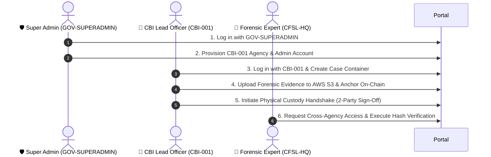

# 📖 Complete Manual Testing & User Story Guide (`sih_ps1`)

This is the comprehensive, end-to-end manual testing guide for the **Secure Digital Document & Evidence Management System (`sih_ps1`)**.

Follow the steps below to execute a complete demonstration of the system starting from a **clean database** with the **System Super Admin**.

---

## 🌐 Quick Access URLs & Credentials

| Service / Resource | Access URL | Default Credentials |
| :--- | :--- | :--- |
| **Frontend Portal** | 👉 [http://localhost:5173/](http://localhost:5173/) | Use Quick Demo Shortcuts on the login page |
| **Backend REST API** | 👉 [http://localhost:5000/api](http://localhost:5000/api) | Health Check: `http://localhost:5000/health` |
| **Interactive Swagger Docs** | 👉 [http://localhost:5000/api-docs](http://localhost:5000/api-docs) | Complete 26-endpoint API reference |

---

## 🏛️ System Architecture Flow

---

## 🚀 Step-by-Step Test Guide

### 🎭 User Story 1: Platform Super Admin Agency Provisioning & Bootstrapping

**Role**: National Evidence Governance Board Super Admin (`GOV-SUPERADMIN`)  
**Objective**: Log in to the platform governance space, register a new law enforcement agency (`CBI-001`), and provision its primary Organization Administrator.

#### Steps to Execute:
1. Open your browser and navigate to **[http://localhost:5173/login](http://localhost:5173/login)**.
2. At the bottom of the form under **⚡ Quick Demo Login Shortcuts**, click **`🛡️ Super Admin`**.
   - *(Auto-fills: Org Code: `GOV-SUPERADMIN`, Email: `superadmin@gov.in`, Password: `Password123!`)*
3. Click **Sign In to Portal**.
   - *Verification*: Redirection to the **System Overview Dashboard** displaying platform metrics and zero-trust security indicators.
4. Click **Organizations** in the left sidebar menu (`/organizations`).
5. Click **Register Organization** (top right button).
6. Fill in the agency bootstrapping form:
   - **Organization Official Name**: `Central Bureau of Investigation`
   - **Agency Short Code / Prefix**: `CBI-001`
   - **Admin Officer Name**: `Sub-Inspector Anil Kumar`
   - **Official Admin Email**: `anil.kumar@cbi.gov.in`
   - **Temporary Password**: `Password123!`
7. Click **Bootstrap & Provision Agency**.
   - *Verification*: A new agency card for `Central Bureau of Investigation (CBI-001)` appears on the grid.

---

### 🎭 User Story 2: Agency Lead Officer Case Creation & Evidence Upload

**Role**: CBI Lead Investigating Officer (`CBI-001`)  
**Objective**: Log in as the newly provisioned CBI Lead Officer, create an isolated case container, and upload forensic evidence files to AWS S3 & Ethereum blockchain.

#### Steps to Execute:
1. Log out or return to **[http://localhost:5173/login](http://localhost:5173/login)**.
2. Under **⚡ Quick Demo Login Shortcuts**, click **`🏢 CBI Lead Officer`**.
   - *(Auto-fills: Org Code: `CBI-001`, Email: `anil.kumar@cbi.gov.in`, Password: `Password123!`)*
3. Click **Sign In to Portal**.
4. Click **Cases** in the left sidebar (`/cases`).
5. Click **Create New Case Container** and enter:
   - **Case Title**: `Multi-State Cyber Ransomware & Disk Tampering`
   - **Case Number / Tag**: `CASE-2026-9041`
   - **Description**: `Joint investigation into compromised banking servers and forensic disk dumps.`
   - **Classification Level**: `SECRET`
6. Click **Create Case Container**.
7. Click **Documents** in the sidebar (`/documents`).
8. Click **Upload Evidence Document** and fill in:
   - **Case ID**: Select `CASE-2026-9041`
   - **Document Title**: `Seized Server Master Disk Dump (SHA-256)`
   - Choose any PDF or image file from your computer and submit.
9. *Verification*: 
   - File streams directly to your AWS S3 bucket (`sih-ps-190-document-bucket`).
   - A cryptographic SHA-256 fingerprint is calculated and anchored onto the Ethereum smart contract.

---

### 🎭 User Story 3: Physical Evidence & Chain-of-Custody 2-Party Handshake

**Role**: CBI Evidence Vault Custodian  
**Objective**: Transfer physical seized property (e.g., forensic drive) between two officers with a 2-party cryptographically signed handshake.

#### Steps to Execute:
1. Navigate to **Custody** in the sidebar (`/custody`).
2. Click **Initiate Custody Transfer**.
3. Fill in:
   - **Evidence Item**: `EVID-2026-9041` (`Seized Dell Latitude Forensic Workstation`)
   - **Receiving Officer**: `Senior Inspector Rajesh Sharma (CBI)`
   - **Transfer Reason**: `Forensic drive extraction and hash computation`
4. Click **Initiate Custody Transfer**.
   - *Verification*: Status updates to **`PENDING`** sign-off.
5. Click **Accept Pending Sign-off** button at the top.
6. Enter Transfer ID `trf-001` and click **Accept Custody & Sign Ledger**.
   - *Verification*: Status updates to **`ACCEPTED`** with a green **`HANDSHAKE VERIFIED`** badge.

---

### 4. User Story 4: Zero-Trust Cross-Agency Access Request & Cryptographic Audit

**Role**: Inter-Departmental Lead Officer  
**Objective**: Manage cross-agency permission delegation when external departments (e.g., CFSL Cyber Cell) request case access, and run hash verification.

#### Steps to Execute:
1. Click **Access Requests** in the sidebar (`/access-requests`).
2. Click **Request External Access**:
   - **Target Case ID**: `CASE-2026-0892`
   - **Target Holding Agency**: `State Police Cyber Crime Division`
   - **Legal Justification**: `Cross-agency financial ledger analysis and evidence correlation`
3. Click **Submit Request**.
4. In the access request list, click **Grant Access** on pending requests.
   - *Verification*: Status badge updates to green **`APPROVED`**.
5. Click **Verification** in the sidebar (`/verification`).
6. Click **Execute Dual-Hash Comparison**:
   - *Verification*: System compares local SHA-256 binary hash against Ethereum Keccak-256 on-chain block receipt and confirms **`STATUS: 100% Cryptographic Match Confirmed`**.

---

## 📋 Comprehensive Manual Test Checklist

- [ ] **Database State**: Confirm DB starts clean with only Super Admin (`GOV-SUPERADMIN` / `superadmin@gov.in`).
- [ ] **User Story 1**: Provision agency `CBI-001` & Admin account via Super Admin.
- [ ] **User Story 2**: Create Case `CASE-2026-9041` and upload forensic file to AWS S3 & Blockchain.
- [ ] **User Story 3**: Perform 2-party physical custody handshake (`/custody`).
- [ ] **User Story 4**: Approve cross-agency access request (`/access-requests`).
- [ ] **Audit & Verification**: Run dual-hash cryptographic verification (`/verification`).
